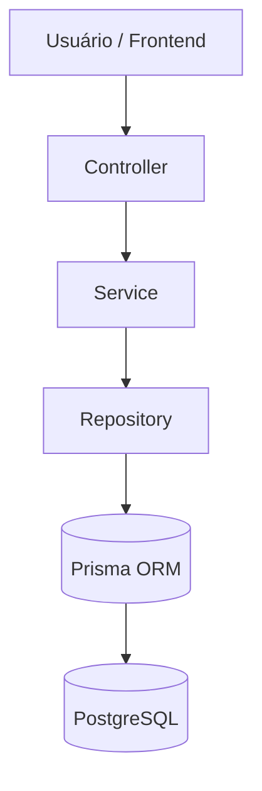
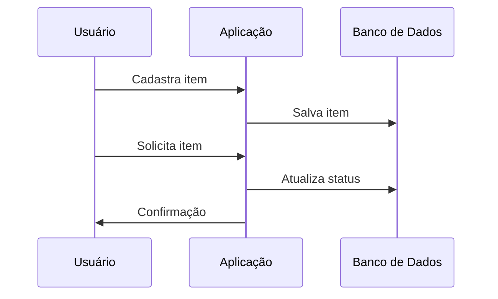

<p align="center">
  
</p>

<h1 align="center">Passe Adiante</h1>
<h3 align="center">Um caderno a menos parado, um estudante a mais preparado.</h3>

<p align="center">
  
  
  
  
  
</p>

---

## 📌 Sobre o Projeto

O **Passe Adiante** é uma plataforma web desenvolvida para conectar doadores e estudantes em situação de vulnerabilidade econômica, promovendo o reaproveitamento de materiais escolares e incentivando práticas de consumo consciente e economia circular.

---

## 📑 Índice

* [🎯 Motivação](./docs/motivation.md)
* [🏗 Arquitetura e Organização](./docs/architecture-and-organization.md)
* [✨ Possíveis usos da nossa solução](./docs/possible-users-of-solution.md)
* [🛠 Manual de Instalação](./docs/instalation-manual.md)
* [🔁 Comandos Básicos do Git](./docs/basics-git-commands.md)
* [🧪 Testes](#-testes)
* [🤝 Contribuição](#-contribuição)
* [📄 Licença](#-licença)

---

## 🧩 Arquitetura da Aplicação


---

## 🔄 Fluxo de Doação de Material



---

## 🧪 Testes

```bash
npm run test
```

---

## 🤝 Contribuição

1. Faça um fork do projeto
2. Crie uma branch (`git checkout -b feature/nova-feature`)
3. Commit suas mudanças (`git commit -m "feat: descrição"`)
4. Push para a branch (`git push origin feature/nova-feature`)
5. Abra um Pull Request

---

## 📄 Licença

Este projeto está sob a licença **MIT**.

---

<p align="center">
  Desenvolvido com ❤️ para impacto social
</p>
