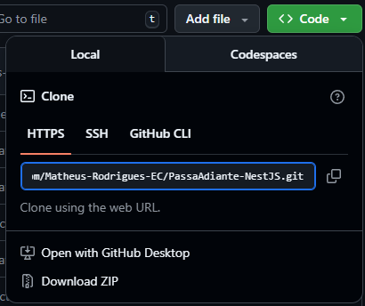

<h1 align='center'>Manual de uso</h1>

#### [Início](../README.md)

## Como usar?

1. Faça um clone do repositório:
   1. Clique em ``` < > code ```
   2. 
   3. Copie a URL exibida no modo HTTPS.

2.  No seu Terminal digite os seguintes passos:
  ```sh
   git clone

   cd PassaAdiante-NestJS

   npm install
   ```

3. Crie um arquivo na raiz do seu projeto chamado: **.env** e nele adicione o endereço para o banco de dados da seguinte forma:

  ```sh
    DATABASE_URL='postgres://[usuário]:[senha]@[host]:[porta]/[nome_do_banco]?opcoes_adicionais'
  ```

4. Em seguida, pode executar o projeto no seu ambiente local com:

```sh
  npm run start:dev
```